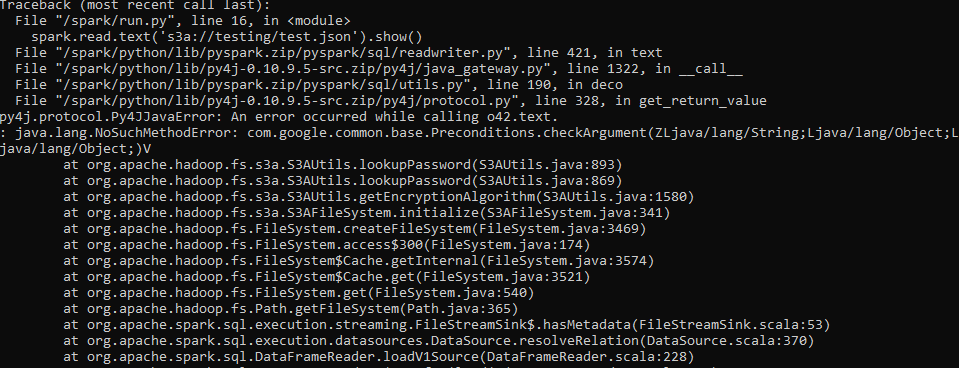

# Minio-Spark Integration Example

## A fully functional EXAMPLE project written in Python showing how to integrate MinIO and Spark 3.3.0 

## Problem Description

This project is an example of how to integrate Apache Spark 3.3.0 with Minio in a local environment. It specifically addresses an issue with the Guava package version that causes an error when attempting this integration.

```bash
    java.lang.NoSuchMethodError: com.google.common.base.Preconditions.checkArgument
```


## Solution

The solution to this issue involves replacing the *guava-14.0.1.jar* in the Spark environment with *guava-27.0-jre.jar*. This is done in the [Dockerfile](Dockerfile.sparkmaster), which you can view in the root directory of this repository.

## Steps to run

`NOTE`: This is just an example, so you can define the Docker image name, bucket, and file name as preferred.

1. Build the Docker image for spark-master using the Dockerfile.

```bash
   docker build -f Dockerfile.sparkmaster -t aco99/sparkmaster:latest .
```

2. Start the services with Docker Compose.

```bash
    docker-compose up -d
```

3. Once the services are up, create a new bucket and add a test file in Minio. [Minio UI](http://localhost:9001/)

4. Execute the Python script run.py that is mounted to the spark-master container. This script is located in the root directory of this repository and it will read the test file from the Minio bucket.
```bash
    docker exec -it spark-master /bin/bash
    cd /spark/bin/
    ./spark-submit --packages org.apache.hadoop:hadoop-aws:3.3.0 ../run.py 
```
